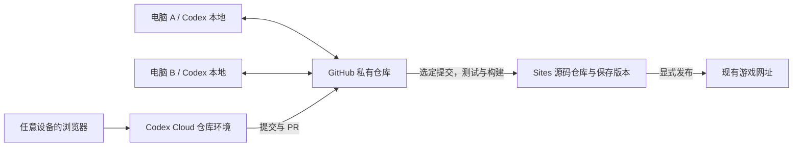

# 豌豆突突队 · 咕噜游乐场

儿童打字冒险游戏，包含字母、英语单词、音标和双语句子练习。

## 项目入口

- GitHub 主仓库：https://github.com/496219531/letter-island
- 现有网站：https://letter-island-hank-sep26.almond-lamb-0557.chatgpt.site
- Sites 项目：`appgprj_6a9bc9cf4e5c819184c22259a0f4c6ed`
- 本次恢复基线：Sites 保存版本 16，提交 `6960e559ba26a0e6790ea495e692a77b6fc69522`。

## 本地开发

需要 Node.js 22 和 Python 3；目前没有需要安装的 npm 依赖。

```sh
git clone https://github.com/496219531/letter-island.git
cd letter-island
npm test
npm run build
npm run dev
```

打开 http://127.0.0.1:4173 。长时间运行与内存检查使用 `npm run test:memory`。

## 多设备与云端开发



GitHub 为后续开发主仓库；`origin` 指向 GitHub。Sites 的独立源码仓库使用 `sites` remote，为保存版本提供提交来源，不能将它误认为 GitHub 仓库。

换机器前提交并推送修改；另一台机器开始前使用 `git pull --ff-only`。并行修改使用不同分支，经 PR 合并。未提交文件、本地任务记录和浏览器存档不会因为 GitHub 同步而一起迁移。

要启用 Codex Cloud，在 https://chatgpt.com/codex 中授权此私有仓库，并为它创建环境。设置 Node.js 22；验证命令为 `npm test && npm run build`。之后可以从不同设备的浏览器选择该环境发起任务。此步骤需要账号内完成仓库授权与环境设置；创建 GitHub 仓库本身不会自动启用云端环境。

## 更新现有 Sites

保留 `.openai/hosting.json` 中的项目 ID。源码是静态 HTML/CSS/JavaScript，`npm run build` 产出 `dist/`。

1. 拉取 GitHub 中要发布的提交，运行测试并构建。
2. 使用 Sites 工具取得短期仓库凭据，将同一提交推送至 Sites 源码仓库；凭据仅按命令使用，不写进 remote、文件或 Git 历史。
3. 使用该提交 SHA 保存 Sites 版本，按当前 Sites 工具要求准备源码归档。
4. 在用户要求发布时，部署该保存版本并检查部署结果。

GitHub CI 只运行检查，不自动部署、不改变现有网站访问权限。不要为此游戏重复创建 Site。GitHub 合并不会自动改变线上游戏；未上传到 Sites 的另一台机器修改也不包含在本次恢复中。

## 文件

- `index.html`、`game.js`、`styles.css`：主游戏界面。
- `engine.js`：游戏规则与战斗引擎。
- `save.js`、`sound.js`：存档与音效。
- `adventure.*`：冒险界面。
- `assets/`：图片素材。
- `tests/`：现有游戏逻辑与长时间运行检查。

