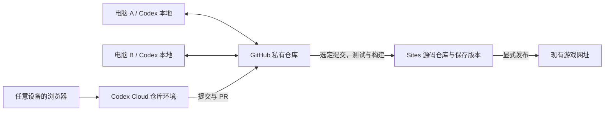

# 豌豆突突队 · 咕噜游乐场

儿童打字冒险游戏，包含字母、英语单词、音标和双语句子练习。英语词库按课标学段整理为 3097 个独立拼写项，提供小学入门 200、小学核心 505、初中核心 1600、高中必修 2101、高中选择性必修 3097 的累计练习池；句子与口语使用300组完整情境对话，共900句去重英文，每档60组、180句。单词范围参考上海市教委转发的2022年义务教育课标和2025修订版高中课标；句库按小学基础、小学应用、初中生活、初中协作、高中交流提供学段参考，每组标注交际目标和语法点；这些是原创编写标注，不是教材原句或考试等级。数量口径、来源和适用范围见 `vocabulary-guide.html`。

## 项目入口

- GitHub 主仓库：https://github.com/496219531/letter-island
- 现有网站：https://letter-island-hank-sep26.almond-lamb-0557.chatgpt.site
- Sites 项目：`appgprj_6a9bc9cf4e5c819184c22259a0f4c6ed`
- 本次恢复基线：Sites 保存版本 16，提交 `6960e559ba26a0e6790ea495e692a77b6fc69522`。

## 本地开发

需要 Node.js 22 和 Python 3；目前没有需要安装的 npm 依赖。

```sh
git clone https://github.com/496219531/letter-island.git
cd letter-island
npm test
npm run build
npm run dev
```

打开 http://127.0.0.1:4173 。长时间运行与内存检查使用 `npm run test:memory`。

## 局域网双人对战

在一台电脑的项目目录运行：

```sh
npm run lan
```

房主打开 http://127.0.0.1:4174/duel.html ，输入名字、选择题目模式，然后创建房间。把页面中的邀请地址发给同一局域网内的另一台电脑；对方打开地址、输入名字并加入，双方点击「我准备好了」就会开战。终端也会打印局域网 IP 地址，第二台电脑无需安装 Node.js 或复制项目。保持房主的服务进程运行；如果系统询问网络访问，请允许局域网连接。端口被占用时使用 `PORT=4175 npm run lan`。

- 双方后院位于同一战场两端。僵尸从自家后院出发，同路遇到敌军时停下互相啃食，消灭对手后继续前进、啃食对方后院。基础僵尸自动出发，每秒获得 2 阳光，也能派出疾跑、铁桶和爆破僵尸；阳光上限 100，派兵间隔 2 秒。
- 大招支持字母、英语单词和英语句子。双方难度一致，题目、输入进度、技能冷却和已见词记录完全独立；优先未练词，同一房间再来一局保留各自记录。点击技能后输入题目，或直接输入题目的首字母选招；空格、连字符、撇号和缩写句点需要按题目输入，Backspace 退一格，Esc 取消。
- 彩虹激光、冰冻和西瓜大招只作用于共享战场上的敌方僵尸，不伤害己方僵尸或后院。冰冻会同时阻止被冻僵尸移动和互啃。普通射击守卫近院范围，大招可支援前线；默认自动射击，关闭后鼠标瞄准、按住射击。
- 后院防御归零并持续 3 秒即告负；同一时刻双方失守则平局。结算后双方准备即可再来一局。
- 任意一方断线时整场暂停，30 秒内刷新或恢复连接可继续；超时判掉线方负，双方均掉线则结束。对战状态保存在运行中的服务内，不使用或覆盖单人浏览器存档。

双方必须打开同一台电脑提供的地址。普通静态服务器或现有线上静态网站不提供对战同步，需要使用上面的局域网服务。测试使用 `npm run test:lan`，已包含在 `npm test` 中；覆盖独立题目、伤害归属、派兵、房间鉴权、双连接同步、断线恢复和胜负结算。

## 多设备与云端开发



GitHub 为后续开发主仓库；`origin` 指向 GitHub。Sites 的独立源码仓库使用 `sites` remote，为保存版本提供提交来源，不能将它误认为 GitHub 仓库。

换机器前提交并推送修改；另一台机器开始前使用 `git pull --ff-only`。并行修改使用不同分支，经 PR 合并。未提交文件、本地任务记录和浏览器存档不会因为 GitHub 同步而一起迁移。

要启用 Codex Cloud，在 https://chatgpt.com/codex 中授权此私有仓库，并为它创建环境。设置 Node.js 22；验证命令为 `npm test && npm run build`。之后可以从不同设备的浏览器选择该环境发起任务。此步骤需要账号内完成仓库授权与环境设置；创建 GitHub 仓库本身不会自动启用云端环境。

## 更新现有 Sites

保留 `.openai/hosting.json` 中的项目 ID。源码是静态 HTML/CSS/JavaScript，`npm run build` 产出 `dist/`。

1. 拉取 GitHub 中要发布的提交，运行测试并构建。
2. 使用 Sites 工具取得短期仓库凭据，将同一提交推送至 Sites 源码仓库；凭据仅按命令使用，不写进 remote、文件或 Git 历史。
3. 使用该提交 SHA 保存 Sites 版本，按当前 Sites 工具要求准备源码归档。
4. 在用户要求发布时，部署该保存版本并检查部署结果。

GitHub CI 只运行检查，不自动部署、不改变现有网站访问权限。不要为此游戏重复创建 Site。GitHub 合并不会自动改变线上游戏；未上传到 Sites 的另一台机器修改也不包含在本次恢复中。

## 文件

- `index.html`、`game.js`、`styles.css`：主游戏界面。
- `engine.js`：游戏规则与战斗引擎。
- `vocabulary.js`、`vocabulary-guide.html`：课标词库、学段范围和来源说明；`licenses/ECDICT.txt` 保留释义与音标数据许可。
- `save.js`、`sound.js`：存档与音效。
- `adventure.*`：冒险界面。
- `assets/`：图片素材。
- `tests/`：现有游戏逻辑与长时间运行检查。

## 按住录音与系统识别

单人英语口语模式：选大招卡，按住游戏里的麦克风录音，松开立即停止录音，再由本机 macOS Speech 自动识别并匹配题目；不需要输入框、系统听写快捷键或手动提交。选择英语口语时会在用户操作中立即调用getUserMedia请求浏览器麦克风权限，获得流后立即关闭，再由独立的GuluSpeech.app请求系统语音识别权限；也提供不依赖开始游戏或选技能的启用按钮。授权流程独立于录音，失焦和松手不会取消权限设置。完成授权后再按住录音。识别时强制使用设备端模式，不回退到浏览器联网 SpeechRecognition。

网页通过 AudioWorklet 采集本机麦克风，生成最长30秒的单声道PCM WAV；只有localhost能访问原生助手。录音临时文件在识别结束或失败后删除。切换题目、暂停、失焦或离开页面会停止录音并丢弃旧识别结果。系统朗读示范仍只选择已安装的本地英文声音。

原生助手以macOS应用包提供，通过LaunchServices启动，确保系统识别授权与实际识别使用相同的应用身份。提供Mac Intel与Apple芯片通用二进制，最低构建目标macOS 13；实际设备还需支持本地英文语音识别并具备相应语言资源。Windows、Linux和远程局域网页面暂不支持这个Mac本地识别助手，其他游戏功能不受影响。

源码位于native/SpeechHelper.swift，带语音识别用途声明；Mac开发者安装Xcode命令行工具后可运行node native/build.mjs重建。随运行包已附二进制，玩家无需编译。测试不会擅自打开真实麦克风或代替用户同意系统权限。

macOS 26 且硬件支持时，优先使用系统 SpeechAnalyzer/SpeechTranscriber 设备端识别；首次启用语音会通过 Apple AssetInventory 准备英文资源，可能需要联网下载一次语言模型。旧版系统使用本地 SFSpeechRecognizer，需启用系统听写服务。下载语言资源与语音识别授权不录音，识别录音仍留在本机。

## 情境句库维护

`data/dialogues.tsv` 保存300组人工编写的完整对话及中译、交际目标、语法标签。运行 `node build-dialogues.mjs` 会生成前端和服务器共用的 `dialogues.js`，并验证900句英文不重复、分组数量、拼写字符和输入长度。`dialogue-guide.html` 可按学段、场景、目标、语法或英文搜索全部对话。

单人句子、口语及对战句子模式共用句库。旧的200组题目仅在存档兼容查找表中保留，新出题只使用新库。新增对话内容时不要通过复用整句或只替换名词凑数量。

### 手机版

手机与运行游戏的电脑连接同一 Wi-Fi，在手机浏览器打开启动器给出的局域网地址（单人入口 `/`，对战入口 `/duel.html`）。自动适配触屏：隐藏纯打字/字母组合选项，保留英语单词、句子、单人口语和已有对战模式；单人默认自动射击，大招卡片横滑，使用屏幕键盘输入。桌面模式不变。旧字母模式存档在手机继续时改为英语单词题，保留波次和强化。

手机口语使用浏览器的 SpeechRecognition（可能联网），保留按住朗读、松开停止。需要受信任的 HTTPS 与支持语音识别的浏览器；普通局域网 HTTP 不能申请手机录音权限，仍可玩单词、句子和对战。桌面 Mac 继续使用本机原有语音助手。手机版未经过真实 iPhone/Android 录音验收。接口参考：https://developer.mozilla.org/en-US/docs/Web/API/SpeechRecognition/stop 。

手机口语的 HTTPS 启动方式：准备覆盖局域网 IP/域名、且已被手机信任的证书与私钥，然后运行 `GULU_TLS_CERT=/证书路径/cert.pem GULU_TLS_KEY=/私钥路径/key.pem PORT=4175 npm run lan`。在手机打开输出的 `https://` 地址。证书警告页直接点继续不等于证书受信任，不要关闭浏览器安全校验。证书与私钥不随运行包分发。

### 自定义词句库

主页“我的词句库”支持单词组和句子组。默认文本框逐行输入，格式为 `英文 | 中文 | 音标`，后两项可空。预览时优先从现有标准词句库补空缺，不覆盖人工填写的内容。可以逐条编辑、删除，也可以在文本框拆分或合并。保存后在主页“练习题库”选中分组开始新局。单词组用于单词练习，句子组用于句子和口语；自定义句子一条就是一道题。每组最多300条、最多30组，同组重复英文保存时保留第一条。少量条目或同首字母较多时，可以手动选技能。

当前存档包含所选词库的快照，删除或编辑分组不影响继续旧局。自定义口语支持跳过与复盘，复盘句子可以加入新句子组。支持JSON导入导出，iPhone使用系统分享。手机和网页的词库分别本地保存，不自动同步。

图片导入在文本框下方。选照片、查看原图，再主动点“用Qwen整理图片”；输出先回填文本框，人工校正后预览与保存。默认 Qwen `qwen3.7-flash` 视觉模型，需要联网和API额度。iPhone编辑页“设置Qwen API密钥”保存到本机钥匙串，不写进网页和安装包。网页版启动服务时设置 `QWEN_API_KEY`，图片接口只接受服务电脑本地请求。模型文档：https://www.alibabacloud.com/help/zh/model-studio/qwen-vl-compatible-with-openai 。未配置密钥时，手动添加、本地补全和游戏不受影响。

iPhone可主动选择“用苹果翻译补缺失中文”。iOS18+使用Translation框架，首次可能需下载语言资源。只填空白中文；音标仍由本地词库或人工补充。英文修改后请同时核对释义和音标。Qwen实际调用需要配置有效账号验证，苹果语言资源准备须在设备上完成。

Qwen图片服务使用用户指定的兼容地址：`https://ws-6xyzvsketfz7g5y6.cn-beijing.maas.aliyuncs.com/compatible-mode/v1`，请求路径为 `/chat/completions`。默认 `qwen3.7-flash`。网页版可设置 `QWEN_API_KEY`（或 `DASHSCOPE_API_KEY`），用 `QWEN_MODEL` 覆盖模型名；iPhone在“设置Qwen API密钥”里填写此工作空间的密钥与视觉模型名称。Qwen密钥与旧DeepSeek钥匙串项分开保存，不复用旧密钥。接口测试使用模拟响应，真实图片调用仍需有效密钥与模型权限验证。
